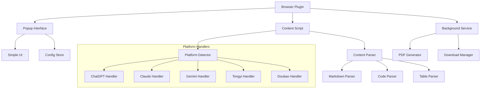

# System Patterns

## Architecture Overview

### Component Structure



## Core Components

### 1. Browser Plugin (Extension Core)

- Lightweight extension core
- Minimal permission requirements
- Event coordination
- State management

### 2. Platform Detection & Parsing

- Platform-specific content handlers
- Unified parsing interface
- Conversation boundary detection
- Dynamic content handling

### 3. Content Processing

- Markdown processing
- Code block handling
- Table formatting
- Math equation support
- Image processing (basic)

### 4. PDF Generation

- Direct HTML to PDF conversion
- Custom styling templates
- Metadata injection
- Page number handling

### 5. User Interface

- Minimal popup UI
- Progress indication
- Error display
- Basic settings

## Design Patterns

### 1. Strategy Pattern (Platform Handling)

```typescript
interface PlatformHandler {
  canHandle(url: string): boolean;
  getConversation(): Promise<Conversation>;
  getMetadata(): ConversationMetadata;
}

class ChatGPTHandler implements PlatformHandler {
  // Implementation
}

class ClaudeHandler implements PlatformHandler {
  // Implementation
}
```

### 2. Builder Pattern (PDF Generation)

```typescript
class PDFBuilder {
  private doc: PDFDocument;

  addMetadata(): PDFBuilder;
  addConversation(): PDFBuilder;
  addFooter(): PDFBuilder;
  build(): PDF;
}
```

### 3. Observer Pattern (Progress Tracking)

```typescript
interface ProgressObserver {
  onProgress(progress: number): void;
  onComplete(result: PDF): void;
  onError(error: Error): void;
}
```

### 4. Singleton Pattern (Configuration)

```typescript
class ConfigStore {
  private static instance: ConfigStore;

  static getInstance(): ConfigStore;
  getConfig(): Config;
  setConfig(config: Partial<Config>): void;
}
```

## Error Handling Strategy

1. Platform Detection Errors

   ```typescript
   try {
     const handler = PlatformDetector.getHandler(url);
   } catch (e: PlatformNotSupported) {
     notifyUser("This platform is not supported yet");
   }
   ```

2. Content Parsing Errors

   ```typescript
   try {
     const content = await handler.getConversation();
   } catch (e: ParseError) {
     retryWithFallback();
   }
   ```

3. PDF Generation Errors
   ```typescript
   try {
     const pdf = await PDFBuilder.build(content);
   } catch (e: GenerationError) {
     savePartialResult();
   }
   ```

## Performance Optimizations

1. Lazy Loading

   - Load platform handlers on demand
   - Initialize PDF generator when needed
   - Defer resource-heavy operations

2. Caching

   - Cache parsed content temporarily
   - Store platform-specific selectors
   - Remember user preferences

3. Resource Management

   - Clean up after conversion
   - Release memory proactively
   - Minimize DOM operations

4. Async Operations
   - Non-blocking content parsing
   - Progressive PDF generation
   - Background processing
